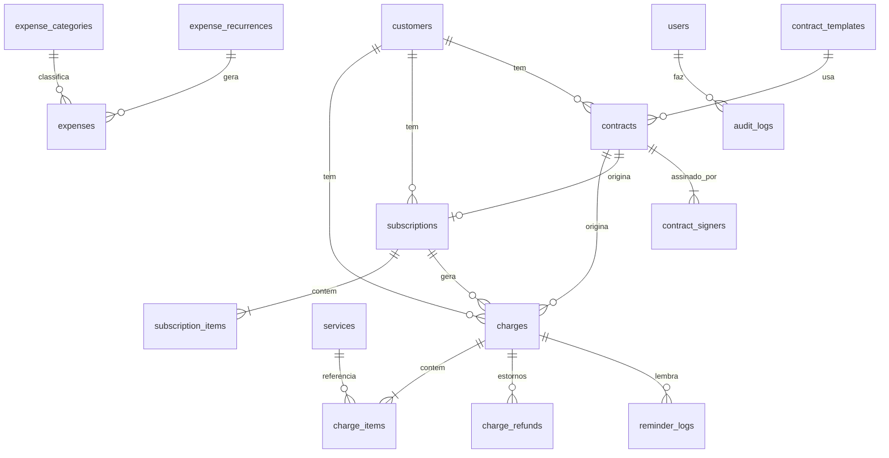

# Modelo de dados

> Status: **Aprovado** · Fonte da verdade do schema. Toda mudança aqui vem com migration Prisma no mesmo commit.

Convenções: tabelas e colunas em `snake_case` (Prisma com `@@map`/`@map`), IDs `uuid`, dinheiro em centavos (`Int`; usar `BigInt` só se algum total passar de R$ 21 milhões), percentuais em `Decimal(5,2)`, vencimentos em `date`, instantes em `timestamptz`, `created_at`/`updated_at` em todas as tabelas de negócio.

## Diagrama



## Schema Prisma (alvo)

```prisma
generator client {
  provider = "prisma-client"
  output   = "../src/generated/prisma"
}
// URL de conexão em prisma.config.ts (Prisma 7+); PrismaClient usa o adapter @prisma/adapter-pg
datasource db {
  provider = "postgresql"
}

// ───────── Acesso ─────────
enum Role {
  ADMIN
  FINANCEIRO
  LEITURA
}

model User {
  id           String    @id @default(uuid()) @db.Uuid
  name         String
  email        String    @unique
  passwordHash String    @map("password_hash")
  role         Role      @default(FINANCEIRO)
  active       Boolean   @default(true)
  lastLoginAt  DateTime? @map("last_login_at") @db.Timestamptz
  createdAt    DateTime  @default(now()) @map("created_at") @db.Timestamptz
  updatedAt    DateTime  @updatedAt @map("updated_at") @db.Timestamptz
  refreshTokens RefreshToken[]
  @@map("users")
}

model RefreshToken {
  id        String    @id @default(uuid()) @db.Uuid
  userId    String    @map("user_id") @db.Uuid
  tokenHash String    @unique @map("token_hash")
  expiresAt DateTime  @map("expires_at") @db.Timestamptz
  revokedAt DateTime? @map("revoked_at") @db.Timestamptz
  createdAt DateTime  @default(now()) @map("created_at") @db.Timestamptz
  user      User      @relation(fields: [userId], references: [id], onDelete: Cascade)
  @@map("refresh_tokens")
}

model AuditLog {
  id        String   @id @default(uuid()) @db.Uuid
  userId    String?  @map("user_id") @db.Uuid
  action    String   // ex.: charge.cancel, contract.send, settings.update
  entity    String
  entityId  String?  @map("entity_id")
  data      Json?    // diff ou contexto, sem dados sensíveis
  createdAt DateTime @default(now()) @map("created_at") @db.Timestamptz
  @@index([entity, entityId])
  @@map("audit_logs")
}

// Linha única (id = 1)
model Settings {
  id                  Int      @id @default(1)
  companyName         String?  @map("company_name")
  companyDocument     String?  @map("company_document")
  companyCity         String?  @map("company_city") // usada em contrato.cidade
  defaultDueDays      Int      @default(3) @map("default_due_days")
  defaultFinePct      Decimal  @default(2) @map("default_fine_pct") @db.Decimal(5, 2)
  defaultInterestPct  Decimal  @default(1) @map("default_interest_pct") @db.Decimal(5, 2)
  reminderDaysBefore  Int      @default(3) @map("reminder_days_before")
  reminderOnDueDate   Boolean  @default(true) @map("reminder_on_due_date")
  reminderDaysAfter   Int[]    @default([1, 7]) @map("reminder_days_after")
  reminderChannels    String[] @default(["ASAAS"]) @map("reminder_channels") // ASAAS | EMAIL | WHATSAPP
  // mensagens da régua vivem em reminder_templates (spec 08)
  contractChargeDueDays Int    @default(3) @map("contract_charge_due_days")
  companySignerName   String?  @map("company_signer_name")  // signatário padrão da empresa nos contratos (spec 07)
  companySignerEmail  String?  @map("company_signer_email")
  companySignerPhone  String?  @map("company_signer_phone")
  updatedAt           DateTime @updatedAt @map("updated_at") @db.Timestamptz
  @@map("settings")
}

// ───────── Cadastro ─────────
enum PersonType {
  PF
  PJ
}

model Customer {
  id              String     @id @default(uuid()) @db.Uuid
  name            String
  personType      PersonType @map("person_type")
  document        String     @unique // só dígitos
  email           String?
  phone           String?    // só dígitos, com DDD
  address         Json?      // { postalCode, street, number, complement, district, city, state }
  asaasCustomerId String?    @unique @map("asaas_customer_id")
  asaasSyncError  String?    @map("asaas_sync_error") // última falha ao sincronizar edição com o Asaas
  remindersEnabled Boolean   @default(true) @map("reminders_enabled") // false desliga e-mail/WhatsApp e as notificações do Asaas deste cliente (REG-05.1)
  notes           String?
  archivedAt      DateTime?  @map("archived_at") @db.Timestamptz
  createdAt       DateTime   @default(now()) @map("created_at") @db.Timestamptz
  updatedAt       DateTime   @updatedAt @map("updated_at") @db.Timestamptz
  charges         Charge[]
  subscriptions   Subscription[]
  contracts       Contract[]
  @@index([name])
  @@map("customers")
}

model Service {
  id                String   @id @default(uuid()) @db.Uuid
  name              String
  description       String?
  defaultPriceCents Int      @map("default_price_cents")
  active            Boolean  @default(true)
  createdAt         DateTime @default(now()) @map("created_at") @db.Timestamptz
  updatedAt         DateTime @updatedAt @map("updated_at") @db.Timestamptz
  @@map("services")
}

// ───────── Cobranças ─────────
enum ChargeStatus {
  DRAFT
  PENDING
  CONFIRMED
  PAID
  OVERDUE
  CANCELED
  REFUNDED
  PARTIALLY_REFUNDED
  CHARGEBACK
}
enum ChargeType {
  SINGLE
  INSTALLMENT
  RECURRING
}
enum ChargeOrigin {
  MANUAL
  CONTRACT
  SUBSCRIPTION
}
enum BillingType {
  PIX
  BOLETO
  CREDIT_CARD
  UNDEFINED
}
enum Cycle {
  WEEKLY
  BIWEEKLY
  MONTHLY
  BIMONTHLY
  QUARTERLY
  SEMIANNUALLY
  YEARLY
}

model Charge {
  id                 String       @id @default(uuid()) @db.Uuid
  customerId         String       @map("customer_id") @db.Uuid
  contractId         String?      @map("contract_id") @db.Uuid
  subscriptionId     String?      @map("subscription_id") @db.Uuid
  origin             ChargeOrigin @default(MANUAL)
  type               ChargeType
  status             ChargeStatus @default(DRAFT)
  billingType        BillingType  @map("billing_type")
  valueCents         Int          @map("value_cents")
  netValueCents      Int?         @map("net_value_cents")     // líquido informado pelo Asaas
  refundedCents      Int          @default(0) @map("refunded_cents")
  discountCents      Int          @default(0) @map("discount_cents")
  finePct            Decimal      @default(0) @map("fine_pct") @db.Decimal(5, 2)
  interestPct        Decimal      @default(0) @map("interest_pct") @db.Decimal(5, 2)
  dueDate            DateTime     @map("due_date") @db.Date
  description        String
  installmentNumber  Int?         @map("installment_number")
  installmentCount   Int?         @map("installment_count")
  externalReference  String       @unique @map("external_reference") // enviado ao Asaas; = id ou id do grupo
  groupKey           String?      @map("group_key")            // agrupa parcelas antes de existir o installment id
  asaasPaymentId     String?      @unique @map("asaas_payment_id")
  asaasInstallmentId String?      @map("asaas_installment_id")
  invoiceUrl         String?      @map("invoice_url")
  bankSlipUrl        String?      @map("bank_slip_url")
  pixPayload         String?      @map("pix_payload")
  identificationField String?     @map("identification_field") // linha digitável
  paidAt             DateTime?    @map("paid_at") @db.Date
  refundRequestedAt  DateTime?    @map("refund_requested_at") @db.Timestamptz
  lastEventAt        DateTime?    @map("last_event_at") @db.Timestamptz
  lastError          String?      @map("last_error")
  createdById        String?      @map("created_by_id") @db.Uuid
  createdAt          DateTime     @default(now()) @map("created_at") @db.Timestamptz
  updatedAt          DateTime     @updatedAt @map("updated_at") @db.Timestamptz
  customer           Customer     @relation(fields: [customerId], references: [id])
  contract           Contract?    @relation(fields: [contractId], references: [id])
  subscription       Subscription? @relation(fields: [subscriptionId], references: [id])
  items              ChargeItem[]
  refunds            ChargeRefund[]
  reminders          ReminderLog[]
  @@index([status, dueDate])
  @@index([customerId])
  @@index([asaasInstallmentId])
  @@index([groupKey])
  @@map("charges")
}

enum ChargeRefundKind {
  REFUND               // estorno (saída)
  CHARGEBACK           // chargeback aberto (saída) — ADR-011
  CHARGEBACK_REVERSAL  // disputa ganha, valor devolvido (entrada) — ADR-011
}

// Um registro por estorno/chargeback confirmado (webhook ou reconciliação); base do fluxo de caixa
model ChargeRefund {
  id              String   @id @default(uuid()) @db.Uuid
  chargeId        String   @map("charge_id") @db.Uuid
  kind            ChargeRefundKind @default(REFUND)
  valueCents      Int      @map("value_cents")
  refundedAt      DateTime @map("refunded_at") @db.Date
  webhookEventId  String   @unique @map("webhook_event_id") @db.Uuid
  createdAt       DateTime @default(now()) @map("created_at") @db.Timestamptz
  charge          Charge   @relation(fields: [chargeId], references: [id], onDelete: Cascade)
  @@index([refundedAt])
  @@map("charge_refunds")
}

model ChargeItem {
  id             String   @id @default(uuid()) @db.Uuid
  chargeId       String   @map("charge_id") @db.Uuid
  serviceId      String?  @map("service_id") @db.Uuid
  description    String   // nome do serviço congelado
  quantity       Int
  unitPriceCents Int      @map("unit_price_cents")
  totalCents     Int      @map("total_cents")
  charge         Charge   @relation(fields: [chargeId], references: [id], onDelete: Cascade)
  @@map("charge_items")
}

enum SubscriptionStatus {
  ACTIVE
  INACTIVE
  CANCELED
}

model Subscription {
  id                  String             @id @default(uuid()) @db.Uuid
  customerId          String             @map("customer_id") @db.Uuid
  contractId          String?            @unique @map("contract_id") @db.Uuid
  asaasSubscriptionId String?            @unique @map("asaas_subscription_id")
  status              SubscriptionStatus @default(ACTIVE)
  billingType         BillingType        @map("billing_type")
  valueCents          Int                @map("value_cents")
  cycle               Cycle
  nextDueDate         DateTime           @map("next_due_date") @db.Date
  endDate             DateTime?          @map("end_date") @db.Date
  description         String
  finePct             Decimal            @default(0) @map("fine_pct") @db.Decimal(5, 2)
  interestPct         Decimal            @default(0) @map("interest_pct") @db.Decimal(5, 2)
  externalReference   String             @unique @map("external_reference")
  createdAt           DateTime           @default(now()) @map("created_at") @db.Timestamptz
  updatedAt           DateTime           @updatedAt @map("updated_at") @db.Timestamptz
  customer            Customer           @relation(fields: [customerId], references: [id])
  contract            Contract?          @relation(fields: [contractId], references: [id])
  items               SubscriptionItem[]
  charges             Charge[]
  @@map("subscriptions")
}

model SubscriptionItem {
  id             String       @id @default(uuid()) @db.Uuid
  subscriptionId String       @map("subscription_id") @db.Uuid
  serviceId      String?      @map("service_id") @db.Uuid
  description    String
  quantity       Int
  unitPriceCents Int          @map("unit_price_cents")
  totalCents     Int          @map("total_cents")
  subscription   Subscription @relation(fields: [subscriptionId], references: [id], onDelete: Cascade)
  @@map("subscription_items")
}

// ───────── Webhooks ─────────
enum EventSource {
  ASAAS
  CONTRACT
  RECONCILE
}

model WebhookEvent {
  id              String      @id @default(uuid()) @db.Uuid
  source          EventSource
  externalEventId String      @map("external_event_id") // id do evento no provedor; RECONCILE = gerado
  event           String
  resourceId      String?     @map("resource_id")       // pay_…, documento do contrato…
  payload         Json
  receivedAt      DateTime    @default(now()) @map("received_at") @db.Timestamptz
  processedAt     DateTime?   @map("processed_at") @db.Timestamptz
  result          String?     // APPLIED | IMPORTED | IGNORED | IGNORED_TRANSITION | UNKNOWN_RESOURCE
  attempts        Int         @default(0)
  error           String?
  @@unique([source, externalEventId])
  @@index([resourceId])
  @@index([processedAt])
  @@map("webhook_events")
}

// ───────── Contratos ─────────
enum ContractStatus {
  DRAFT
  SENT
  PARTIALLY_SIGNED
  SIGNED
  REFUSED
  EXPIRED
  CANCELED
}
enum SignerRole {
  CLIENT
  COMPANY // obrigatório em todo contrato; sem testemunhas na v1 (spec 07)
}
enum SignerStatus {
  PENDING
  SIGNED
  REFUSED
}

model ContractTemplate {
  id                 String   @id @default(uuid()) @db.Uuid
  name               String
  provider           String   @default("clicksign") // clicksign | fake (dev/testes)
  providerTemplateId String   @map("provider_template_id")
  variableMap        Json     @map("variable_map") // { "<campo no provedor>": "<variável do catálogo>" }
  active             Boolean  @default(true)
  createdAt          DateTime @default(now()) @map("created_at") @db.Timestamptz
  updatedAt          DateTime @updatedAt @map("updated_at") @db.Timestamptz
  contracts          Contract[]
  @@map("contract_templates")
}

model Contract {
  id                 String         @id @default(uuid()) @db.Uuid
  customerId         String         @map("customer_id") @db.Uuid
  templateId         String         @map("template_id") @db.Uuid
  title              String
  status             ContractStatus @default(DRAFT)
  provider           String
  providerEnvelopeId String?        @unique @map("provider_envelope_id") // envelope do Clicksign
  providerDocumentId String?        @unique @map("provider_document_id") // documento do envelope (document.key nos webhooks)
  providerError      String?        @map("provider_error")               // última falha ao enviar
  providerProgress   Json?          @map("provider_progress")            // ProviderProgress: passos já feitos no provedor (retomada)
  variables          Json           // snapshot dos valores enviados
  chargePlan         Json           @map("charge_plan") // ChargePlan (packages/shared)
  totalCents         Int            @map("total_cents")
  sentAt             DateTime?      @map("sent_at") @db.Timestamptz
  signedAt           DateTime?      @map("signed_at") @db.Timestamptz
  expiresAt          DateTime?      @map("expires_at") @db.Timestamptz
  canceledAt         DateTime?      @map("canceled_at") @db.Timestamptz
  signedFileKey      String?        @map("signed_file_key")
  chargeGeneratedAt  DateTime?      @map("charge_generated_at") @db.Timestamptz
  chargeError        String?        @map("charge_error")
  createdById        String?        @map("created_by_id") @db.Uuid
  createdAt          DateTime       @default(now()) @map("created_at") @db.Timestamptz
  updatedAt          DateTime       @updatedAt @map("updated_at") @db.Timestamptz
  customer           Customer       @relation(fields: [customerId], references: [id])
  template           ContractTemplate @relation(fields: [templateId], references: [id])
  signers            ContractSigner[]
  charges            Charge[]
  subscription       Subscription?
  @@index([status])
  @@map("contracts")
}

model ContractSigner {
  id               String       @id @default(uuid()) @db.Uuid
  contractId       String       @map("contract_id") @db.Uuid
  role             SignerRole
  name             String
  email            String
  phone            String?
  document         String?
  signOrder        Int          @default(1) @map("sign_order")
  authMethod       String       @default("email") @map("auth_method") // email | whatsapp | sms (requisito de autenticação no Clicksign)
  status           SignerStatus @default(PENDING)
  providerSignerId String?      @map("provider_signer_id")
  signUrl          String?      @map("sign_url")
  signedAt         DateTime?    @map("signed_at") @db.Timestamptz
  contract         Contract     @relation(fields: [contractId], references: [id], onDelete: Cascade)
  @@map("contract_signers")
}

// ───────── Contas a pagar ─────────
enum ExpenseStatus { // "atrasada" é derivado: OPEN e due_date < hoje
  OPEN
  PAID
  CANCELED
}

model ExpenseCategory {
  id       String    @id @default(uuid()) @db.Uuid
  name     String    @unique
  active   Boolean   @default(true)
  expenses Expense[]
  recurrences ExpenseRecurrence[]
  @@map("expense_categories")
}

model ExpenseRecurrence {
  id              String    @id @default(uuid()) @db.Uuid
  description     String
  categoryId      String    @map("category_id") @db.Uuid
  supplier        String?
  valueCents      Int       @map("value_cents")
  dayOfMonth      Int       @map("day_of_month") // 1–31, ajustado ao último dia do mês
  startMonth      String    @map("start_month")  // YYYY-MM
  endMonth        String?   @map("end_month")
  active          Boolean   @default(true)
  lastGeneratedFor String?  @map("last_generated_for") // YYYY-MM
  createdAt       DateTime  @default(now()) @map("created_at") @db.Timestamptz
  updatedAt       DateTime  @updatedAt @map("updated_at") @db.Timestamptz
  category        ExpenseCategory @relation(fields: [categoryId], references: [id])
  expenses        Expense[]
  @@map("expense_recurrences")
}

model Expense {
  id             String        @id @default(uuid()) @db.Uuid
  description    String
  categoryId     String        @map("category_id") @db.Uuid
  supplier       String?
  valueCents     Int           @map("value_cents")
  dueDate        DateTime      @map("due_date") @db.Date
  status         ExpenseStatus @default(OPEN)
  paidAt         DateTime?     @map("paid_at") @db.Date
  paidValueCents Int?          @map("paid_value_cents")
  paymentMethod  String?       @map("payment_method") // PIX | BOLETO | CARTAO | TRANSFERENCIA | DINHEIRO | DEBITO_AUTOMATICO
  recurrenceId   String?       @map("recurrence_id") @db.Uuid
  referenceMonth String?       @map("reference_month") // YYYY-MM, para recorrências
  notes          String?
  attachmentKey  String?       @map("attachment_key")
  createdById    String?       @map("created_by_id") @db.Uuid
  createdAt      DateTime      @default(now()) @map("created_at") @db.Timestamptz
  updatedAt      DateTime      @updatedAt @map("updated_at") @db.Timestamptz
  category       ExpenseCategory    @relation(fields: [categoryId], references: [id])
  recurrence     ExpenseRecurrence? @relation(fields: [recurrenceId], references: [id])
  @@unique([recurrenceId, referenceMonth])
  @@index([status, dueDate])
  @@map("expenses")
}

// ───────── Régua ─────────
enum ReminderKind {
  CREATED     // cobrança emitida (qualquer origem)
  BEFORE_DUE
  ON_DUE
  AFTER_DUE
  MANUAL      // "Enviar ao cliente" na cobrança
  PAID        // confirmação de pagamento
  REFUNDED    // estorno confirmado
  CANCELED    // cobrança cancelada
}
enum ReminderChannel {
  ASAAS
  EMAIL
  WHATSAPP
}
enum ReminderStatus {
  SENT
  FAILED
  SKIPPED
}

// Uma mensagem por processo × canal; AFTER_DUE/BEFORE_DUE podem ter texto próprio por offset (spec 08)
model ReminderTemplate {
  id         String          @id @default(uuid()) @db.Uuid
  kind       ReminderKind
  channel    ReminderChannel // EMAIL | WHATSAPP (ASAAS não usa modelo)
  offsetDays Int?            @map("offset_days") // null = vale para todos os offsets do tipo
  subject    String?         // obrigatório para EMAIL
  body       String
  active     Boolean         @default(true)
  updatedAt  DateTime        @updatedAt @map("updated_at") @db.Timestamptz
  // O índice real é NULLS NOT DISTINCT, criado por migration SQL (PostgreSQL 15+):
  // CREATE UNIQUE INDEX reminder_templates_uq ON reminder_templates (kind, channel, offset_days) NULLS NOT DISTINCT;
  // Declarado aqui com o mesmo nome para o `migrate dev` não gerar DROP INDEX (ver "Objetos criados por SQL").
  @@unique([kind, channel, offsetDays], map: "reminder_templates_uq")
  @@map("reminder_templates")
}

model ReminderLog {
  id            String          @id @default(uuid()) @db.Uuid
  chargeId      String          @map("charge_id") @db.Uuid
  kind          ReminderKind
  channel       ReminderChannel
  offsetDays    Int             @map("offset_days") // -3, 0, 1, 7…
  referenceDate DateTime        @map("reference_date") @db.Date // dia em que deveria sair
  status        ReminderStatus
  error         String?
  sentAt        DateTime        @default(now()) @map("sent_at") @db.Timestamptz
  charge        Charge          @relation(fields: [chargeId], references: [id], onDelete: Cascade)
  @@index([chargeId])
  @@map("reminder_logs")
  // Índice único PARCIAL criado por migration SQL (Prisma não expressa):
  // CREATE UNIQUE INDEX reminder_logs_auto_uq ON reminder_logs (charge_id, kind, channel, offset_days) WHERE kind <> 'MANUAL';
}
```

## Objetos criados por SQL (fora do que o Prisma expressa)

| Objeto | Migration | Como o Prisma vê |
| --- | --- | --- |
| `reminder_templates_uq` (único, `NULLS NOT DISTINCT`) | `20261007234521_reminder_templates_uq` | Declarado como `@@unique(..., map:)`; o Prisma não enxerga o `NULLS NOT DISTINCT`, mas não tenta recriar |

Regra: toda migration SQL manual precisa deixar `prisma migrate diff --from-config-datasource --to-schema` vazio — senão o próximo `migrate dev` gera `DROP` silencioso. O teste de integração `schema-drift.e2e-spec.ts` garante isso no CI.

## Regras de integridade

| Regra | Onde é garantida |
| --- | --- |
| `charges.value_cents = Σ charge_items.total_cents − discount_cents` (parcelas: o total do grupo) | `ChargesService` + teste |
| Parcelas somam exatamente o total (resto na última) | `splitInstallments` em shared + teste de propriedade |
| Cobrança `PAID`/`CONFIRMED`/`REFUNDED` não é editada | Service lança `CHARGE_NOT_EDITABLE` |
| Um contrato gera cobrança no máximo uma vez | `contracts.charge_generated_at` + lock (`SELECT … FOR UPDATE`) no job |
| Evento de webhook processado uma vez | `@@unique([source, external_event_id])` |
| Despesa recorrente gerada uma vez por mês | `@@unique([recurrence_id, reference_month])` |
| Lembrete automático enviado uma vez por cobrança/tipo/canal/offset (envios MANUAL podem repetir) | índice único parcial `reminder_logs_auto_uq` (migration SQL) |
| Contrato tem exatamente um signatário CLIENT e ao menos um COMPANY | `ContractDraftSchema` (shared) + service |
| Estorno/chargeback registrado uma vez por evento | `charge_refunds.webhook_event_id` único |
| Nome de serviço único entre ativos | índice único parcial `services_name_active_uq` (migration SQL, spec 02) |
| Cliente arquivado não recebe nova cobrança/contrato | Service lança `CUSTOMER_ARCHIVED` |

## Seeds (dev)

- Usuário `admin@financeiro.local` / senha do `.env` (`SEED_ADMIN_PASSWORD`). (Precisa ter domínio com ponto: o `LoginSchema` usa `z.string().email()`.)
- Settings padrão.
- `reminder_templates` padrão: um modelo de e-mail para cada tipo (`CREATED`, `BEFORE_DUE`, `ON_DUE`, `AFTER_DUE`, `MANUAL`, `PAID`, `REFUNDED`, `CANCELED`), textos da spec 08; `PAID`, `REFUNDED` e `CANCELED` começam inativos.
- Categorias de despesa: Pessoal, Impostos, Escritório, Ferramentas, Infraestrutura, Serviços, Marketing, Outros.
- 6 serviços de exemplo e 6 clientes fictícios (os mesmos do protótipo), **sem** `asaas_customer_id`.
- Modelo de contrato do provedor `fake` (o modelo real do Clicksign é cadastrado pela tela, com a chave do sandbox).
