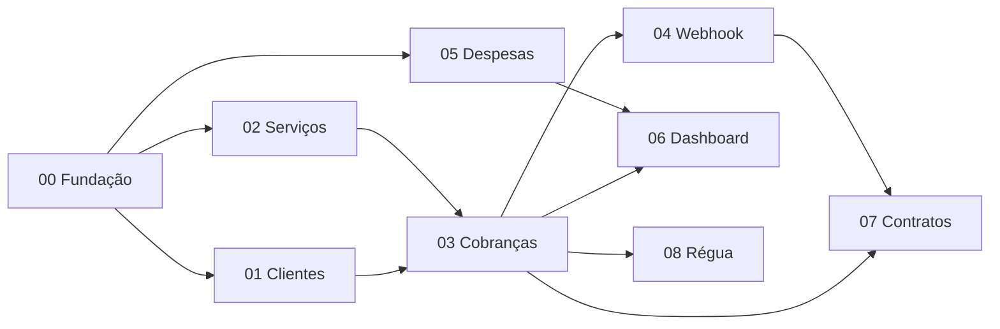

# Specs — índice, status e roadmap

## Como funciona

```
/spec-novo <módulo>       → requirements.md (o quê)     ─┐
/spec-design <módulo>     → design.md (como)             ├─ revisão humana → status "Aprovado"
/spec-tarefas <módulo>    → tasks.md (sequência)        ─┘
/spec-implementar <módulo> → executa a próxima tarefa aberta, com testes
/spec-revisar <módulo>    → confere código × critérios de aceite (rastreabilidade)
/spec-status              → atualiza esta tabela
```

Status possíveis de cada arquivo: `Rascunho` → `Em revisão` → `Aprovado` → (`Implementado` no requirements quando todas as tarefas fecharem). Uma spec aprovada que precise mudar volta para `Em revisão` e ganha linha no `Changelog`.

Formato dos requisitos: **EARS** em português.
- Ubíquo: "O sistema DEVE …"
- Evento: "QUANDO <gatilho>, o sistema DEVE …"
- Estado: "ENQUANTO <estado>, o sistema DEVE …"
- Indesejado: "SE <condição de erro>, ENTÃO o sistema DEVE …"
- Opcional: "ONDE <recurso habilitado>, o sistema DEVE …"

IDs: `<PREFIXO>-NN` para a história e `<PREFIXO>-NN.M` para cada critério. Tarefas citam os IDs que cobrem; testes citam o ID no nome (`it('[COB-02.3] rejeita parcela abaixo do mínimo')`).

## Índice

| # | Módulo | Prefixo | requirements | design | tasks | Marco |
| --- | --- | --- | --- | --- | --- | --- |
| 00 | [Fundação](00-fundacao/) | FND | Aprovado | Aprovado | Aprovado | M0 |
| 01 | [Clientes](01-clientes/) | CLI | Implementado | Aprovado | Aprovado | M1 |
| 02 | [Serviços](02-servicos/) | SRV | Implementado | Aprovado | Aprovado | M1 |
| 03 | [Cobranças](03-cobrancas/) | COB | Aprovado | Aprovado | Aprovado | M2–M3 |
| 04 | [Webhook e reconciliação Asaas](04-webhook-asaas/) | WHK | Aprovado | Aprovado | Aprovado | M2 |
| 05 | [Contas a pagar](05-despesas/) | DSP | Aprovado | Aprovado | Aprovado | M4 |
| 06 | [Dashboard e fluxo de caixa](06-dashboard-fluxo/) | FLX | Aprovado | Aprovado | Aprovado | M5 |
| 07 | [Contratos](07-contratos/) | CTR | Aprovado | Aprovado | Aprovado | M6 |
| 08 | [Régua de cobrança](08-regua-cobranca/) | REG | Aprovado | Aprovado | Aprovado | M7 |

## Roadmap

| Marco | Entrega | Specs | Pronto quando |
| --- | --- | --- | --- |
| **M0** Fundação | Monorepo, Docker, Prisma, auth, usuários, configurações, auditoria, layout do front, CI | 00 | Login funciona, CI verde, `/api/docs` no ar |
| **M1** Cadastros | Clientes e serviços com CRUD e telas | 01, 02 | Cadastrar cliente com CPF/CNPJ validado e serviço com preço |
| **M2** Cobrança avulsa + webhook | Nova Cobrança (avulsa), cliente garantido no Asaas, Pix/boleto/link, webhook idempotente | 03 (parte 1), 04 | Cobrança criada no sandbox e paga pelo painel do Asaas muda para Pago sozinha |
| **M3** Cobranças completas | Parcelada, recorrente, lista com filtros, detalhe, cancelar, estornar, reenviar, reconciliação | 03 (parte 2), 04 (reconciliação) | Fluxos E2E no sandbox para os 3 tipos |
| **M4** Contas a pagar | Despesas, categorias, recorrência | 05 | Despesa recorrente aparece todo mês sozinha |
| **M5** Dashboard e fluxo | KPIs, fluxo mensal, extrato, despesas por categoria | 06 | Números batem com cobranças e despesas de teste |
| **M6** Contratos | Modelos, contratos com FakeProvider, cobrança gerada na assinatura; depois o provedor real | 07 | Contrato assinado no Fake gera cobrança no sandbox; idem no provedor escolhido |
| **M7** Régua | Lembretes antes/depois por Asaas e e-mail | 08 | Lembretes saem uma única vez nos dias certos |
| **M8** Produção | Deploy, backups, domínio, chave e webhook de produção, cobrança real de baixo valor | 00 (seção Produção) | Primeira cobrança real recebida e conciliada |

## Dependências entre specs


