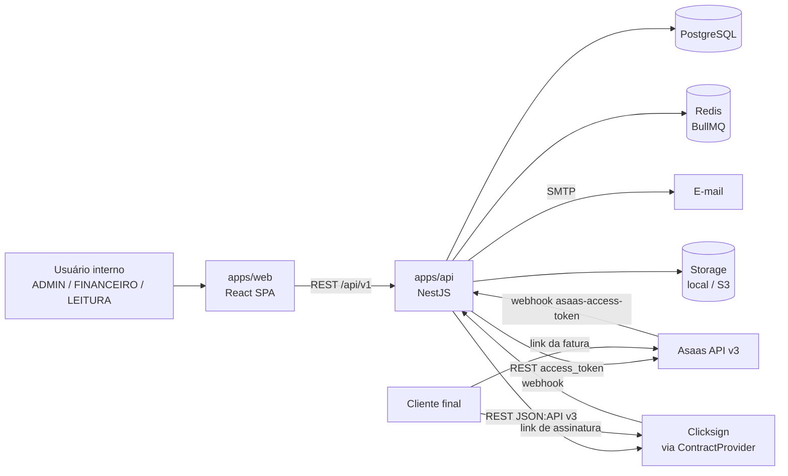
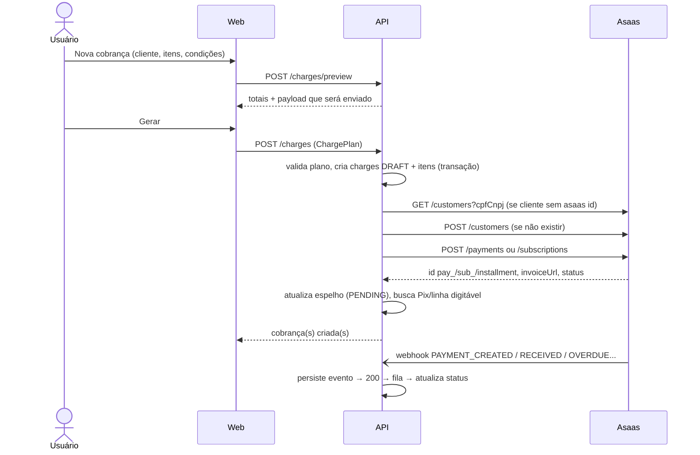
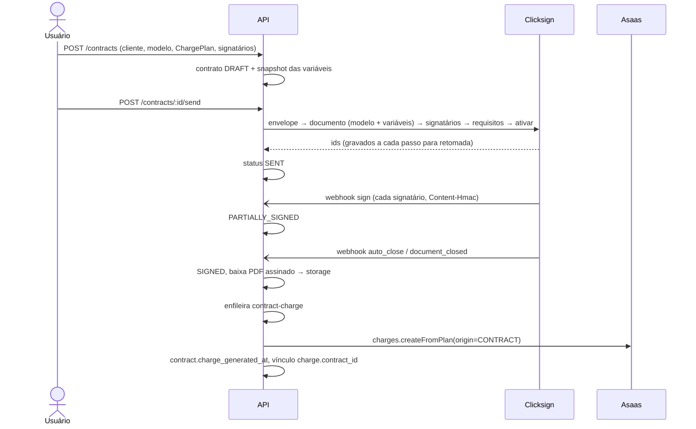
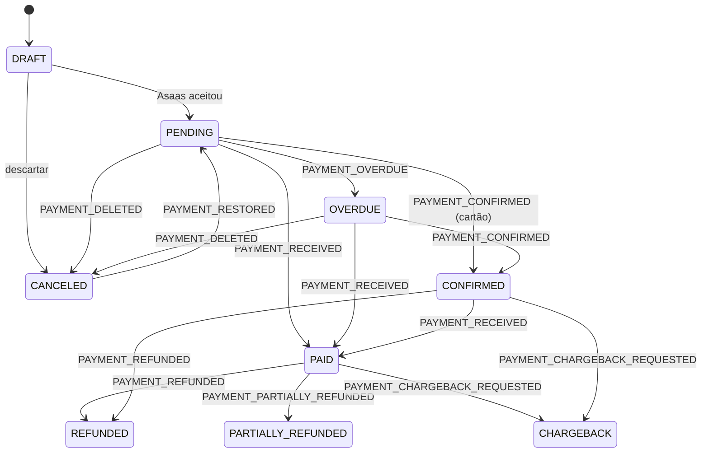

# Arquitetura

> Status: **Aprovado**

## Contexto

## Módulos da API

| Módulo | Responsabilidade | Depende de |
| --- | --- | --- |
| `auth`, `users` | Login, refresh, papéis | — |
| `settings` | Padrões financeiros, régua, status das integrações | — |
| `audit` | Registro de ações sensíveis | — |
| `customers` | Cadastro e garantia do cliente no Asaas (`ensureAsaasCustomer`) | `integrations/asaas` |
| `services` | Catálogo | — |
| `charges` | Plano de cobrança → cobrança/parcelamento/assinatura no Asaas; ações | `customers`, `integrations/asaas` |
| `subscriptions` | Espelho das recorrências | `integrations/asaas` |
| `webhooks` | Recebe, persiste e enfileira eventos (Asaas e contratos) | filas |
| `payment-events` | Processa eventos do Asaas → status de cobrança | `charges`, `subscriptions` |
| `contracts` | Modelos, contratos, signatários; ao assinar → `charges.createFromPlan` | `customers`, `charges`, `integrations/contracts`, `storage` |
| `expenses` | Despesas, categorias, recorrência | — |
| `reports` | Dashboard, fluxo de caixa, extrato (somente leitura) | `charges`, `expenses` |
| `reminders` | Régua de cobrança | `charges`, `integrations/mail`, `settings` |

## Filas (BullMQ)

| Fila | Produzida por | Job | Retry |
| --- | --- | --- | --- |
| `asaas-events` | `POST /webhooks/asaas` | processa 1 `webhook_event` | 5×, backoff exponencial |
| `asaas-events-sweeper` | cron a cada 10 min | reenfileira eventos persistidos e não processados | — |
| `asaas-customer-sync` | edição de cliente (spec 01) | `PUT /customers/{id}` no Asaas | 5× |
| `asaas-notification-sync` | ligar/desligar canal ASAAS da régua (spec 08) | atualiza `notificationDisabled` dos clientes em lote | 3× |
| `contract-events` | `POST /webhooks/contracts/:provider` | processa 1 evento de contrato | 5× |
| `contract-charge` | contrato assinado | `charges.createFromPlan(origin=CONTRACT, idempotencyKey)` | 5×; idempotente por `charge_generated_at` + chave |
| `contract-file` | contrato assinado | baixa o PDF assinado para o storage | 5× |
| `contract-expiration` | cron diário 07:00 | expira contratos com validade vencida | 3× |
| `asaas-reconcile` | cron diário 06:00 | busca no Asaas cobranças locais não finais e corrige divergências | 3× |
| `reminders` | cron diário 09:00 | gera e envia lembretes do dia | 3× por lembrete |
| `expense-recurrence` | cron diário 05:00 | cria despesas das recorrências do mês corrente | 3× |
| `maintenance` | cron mensal | retenção de `webhook_events` (18 meses) | — |

## Fluxo 1 — Cobrança direta

Falha no Asaas após criar o rascunho: a cobrança fica `DRAFT` com `last_error`; o usuário pode "tentar de novo" (reusa o mesmo `externalReference`, sem duplicar) ou descartar.

## Fluxo 2 — Contrato → cobrança

Regra de vencimento na geração pós-assinatura: se o plano diz "N dias após a assinatura", vence em `signed_at + N`; se diz data fixa e ela já passou ou está a menos de `default_due_days` de hoje, usa `hoje + default_due_days`.

## Fluxo 3 — Webhook (qualquer origem)

1. Validar autenticação (token/assinatura). Inválido → 401, nada persistido.
2. `INSERT webhook_events … ON CONFLICT (source, external_event_id) DO NOTHING`.
3. Responder **200** imediatamente (mesmo se duplicado).
4. Se inseriu, enfileirar o processamento com `jobId = webhook_event.id`.
5. Worker aplica a regra; grava `processed_at` ou `error` + `attempts`.
6. Evento que falhar 5× fica visível no log com botão "Reprocessar".

## Fluxo 4 — Reconciliação diária

Para toda cobrança local em `PENDING`, `OVERDUE` ou `CONFIRMED` com `asaas_payment_id`: `GET /payments/{id}`, comparar status e valores; divergência → aplica o status do Asaas e registra `webhook_events` sintético com `source = RECONCILE`. Também importa cobranças de assinaturas que o webhook não trouxe (`GET /payments?subscription=…`).

## Mapa de status de cobrança

Transições fora do mapa são ignoradas (evento marcado como processado com nota `IGNORED_TRANSITION`) — por exemplo, `PAYMENT_OVERDUE` chegando depois de `PAYMENT_RECEIVED` por reordenação.

## Segurança e LGPD

- Dados pessoais: nome, CPF/CNPJ, e-mail, telefone, endereço. Acesso só autenticado; `LEITURA` vê documento mascarado.
- Segredos só em variáveis de ambiente; nunca no banco, no front ou em logs.
- Auditoria (`audit_logs`) para: login, criação/cancelamento/estorno de cobrança, envio/cancelamento de contrato, alteração de configurações, alteração de usuários.
- Backups diários do Postgres em produção (definir na M8).
