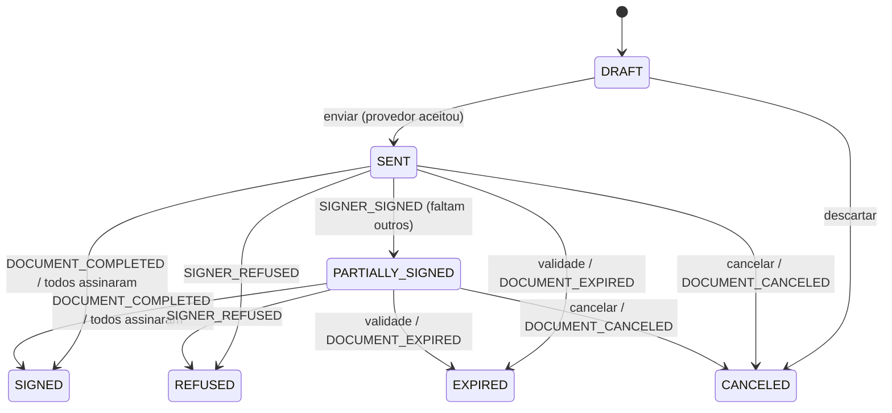

# 07 — Contratos · Design

> Status: **Em revisão** · Implementa: `CTR-01` … `CTR-08` · Ler junto: `docs/integrations/contratos-provider.md`, `docs/integrations/contratos-clicksign.md`, ADR-005, ADR-006, ADR-009

## Componentes

```
ContractTemplatesController/Service      modelos e mapeamento
ContractsController/Service              rascunho, prévia, envio, cancelamento, reenvio
ContractVariablesService                 resolve o catálogo de variáveis (cliente, empresa, plano)
ContractProviderRegistry                 escolhe o adapter por CONTRACT_PROVIDER (fake | clicksign)
  ├─ FakeContractProvider                dev/testes (+ DevFakeSignController em /dev)
  └─ ClicksignContractProvider           API v3 (integrations/contracts/clicksign/)
       ├─ ClicksignHttpClient            JSON:API, Authorization, timeout/retry
       └─ clicksign.mapper.ts            payloads e eventos ↔ interface
WebhooksController POST /webhooks/contracts/:provider → verifyWebhook (Content-Hmac) → WebhookInbox (spec 04) source=CONTRACT
ContractEventsProcessor (fila contract-events)   aplica eventos normalizados
ContractChargeProcessor (fila contract-charge)   gera a cobrança → ChargesService.createFromPlan
ContractSignedFileProcessor (fila contract-file) baixa PDF assinado → StorageService
ContractExpirationJob (cron 07:00)               expira contratos vencidos
```

## Estados



Eventos para estados finais (`SIGNED`, `REFUSED`, `CANCELED`, `EXPIRED`) são ignorados (`IGNORED_TRANSITION`); `SIGNER_SIGNED` em contrato `CANCELED`/`EXPIRED` gera também `audit_logs` `contract.late_signature` (CTR-04.6).

## Schemas (shared/schemas/contract.ts)

```ts
export const VARIABLE_CATALOG = ['cliente.nome', 'cliente.documento', 'cliente.tipo', 'cliente.email', 'cliente.telefone', 'cliente.endereco',
  'empresa.nome', 'empresa.documento', 'servicos.lista', 'servicos.total', 'cobranca.desconto', 'cobranca.valor_total',
  'cobranca.forma', 'cobranca.condicao', 'cobranca.vencimento', 'cobranca.multa', 'cobranca.juros', 'contrato.data', 'contrato.cidade'] as const;

export const TemplateUpsertSchema = z.object({
  name: z.string().min(2).max(120),
  provider: z.string(),
  providerTemplateId: z.string().min(1),
  variableMap: z.record(z.string().min(1), z.enum(VARIABLE_CATALOG)),
  active: z.boolean().default(true),
});

export const SignerInputSchema = z.object({
  role: z.enum(['CLIENT', 'COMPANY']), // sem testemunhas na v1
  name: z.string().min(2), email: z.string().email(),
  phone: z.string().transform(onlyDigits).optional(), document: z.string().optional(),
  signOrder: z.number().int().min(1).max(6).default(1),
  authMethod: z.enum(['email', 'whatsapp', 'sms']).default('email'),
}).refine((s) => s.authMethod === 'email' || (s.phone && /^\d{10,11}$/.test(s.phone)), {
  path: ['phone'], message: 'Celular obrigatório para WhatsApp/SMS', // SIGNER_PHONE_REQUIRED
});

export const ContractDraftSchema = z.object({
  customerId: z.string().uuid(),
  templateId: z.string().uuid(),
  title: z.string().min(3).max(150),
  chargePlan: ChargePlanSchema,
  signers: z.array(SignerInputSchema).min(2).max(6)
    .refine((s) => s.filter((x) => x.role === 'CLIENT').length === 1, 'Inclua o cliente como signatário (uma vez)')
    .refine((s) => s.some((x) => x.role === 'COMPANY'), 'Inclua ao menos um signatário da empresa'), // CTR-02.3
  validDays: z.number().int().min(1).max(90).default(15),
});
```

## Regras

**Prévia / variáveis** — `ContractVariablesService.resolve(customer, plan, settings, signedAt?)`:
- Usa `calculatePlan` (com `signedAt` ausente, `DAYS_AFTER_SIGNATURE` vira o texto "N dias após a assinatura" em `cobranca.vencimento` e as parcelas mostram "1ª: N dias após a assinatura; demais mensais").
- Formatação pt-BR (moeda, datas por extenso em `contrato.data`, endereço em uma linha).
- `fields = Object.fromEntries(Object.entries(template.variableMap).map(([campo, v]) => [campo, resolved[v]]))`; vazios → `CONTRACT_MISSING_VARIABLES` com a lista de variáveis.

**Enviar** — `send(contractId)`:
1. Só de `DRAFT`. Valida cliente ativo, endereço completo (`isAddressComplete` da spec 01 → senão `CUSTOMER_ADDRESS_REQUIRED`, CTR-02.9), modelo ativo, e-mails, signatários (CTR-02.3), variáveis.
2. Tx: grava `variables` (snapshot), `total_cents`, `expires_at = now + validDays`.
3. `provider.createDocument({ externalId: contract.id, …, resume: contract.provider_progress, onProgress })`. `onProgress` grava, a cada passo do Clicksign (envelope → documento → signatários → requisitos → ativação), `provider_progress`, `provider_envelope_id`, `provider_document_id` e `provider_signer_id` — assim um reenvio retoma do passo que falhou (CTR-03.3).
4. Tx: links (quando houver), `status = SENT`, `sent_at`, `provider_error = null`. Auditoria `contract.send`.
5. Falha no provedor → mantém `DRAFT`, grava `provider_error`, lança `CONTRACT_PROVIDER_ERROR` (502) com a mensagem do Clicksign.

**Receber webhook do Clicksign**: `ClicksignContractProvider.verifyWebhook` calcula `HMAC-SHA256(CLICKSIGN_HMAC_SECRET, req.rawBody)` e compara em tempo constante com `Content-Hmac` (`sha256=<hex>`); inválido → 401. `parseWebhook` converte `event.name` conforme a tabela de `contratos-clicksign.md` e gera `eventId` determinístico. O controller persiste cada evento normalizado no `WebhookInbox` e responde 2xx (limite do Clicksign: 5 s).

**Processar evento** — `ContractEventsProcessor.apply(webhookEventId)`: localiza contrato por `provider_document_id` (fallback `provider_envelope_id`); signatário por `provider_signer_id` (fallback e-mail); aplica por tipo:
- `SIGNER_SIGNED` → signatário `SIGNED` + `signed_at`; se todos `SIGNED` → trata como `DOCUMENT_COMPLETED`; senão contrato `PARTIALLY_SIGNED`.
- `DOCUMENT_COMPLETED` (`auto_close`, `close` ou `document_closed`) → contrato `SIGNED`, `signed_at` (do evento), enfileira `contract-charge` com `jobId = "ctrcharge_" + contract.id`. Se o evento trouxer `signedFileUrl` (`document_closed`) ou o contrato ainda não tiver `signed_file_key`, enfileira `contract-file` com `jobId = "ctrfile_" + contract.id` (ADR-010: `jobId` sem `:`; o BullMQ recusaria `"file:" + id`). Um segundo `DOCUMENT_COMPLETED` não muda o estado, mas ainda pode disparar o download se faltar o arquivo.
- `SIGNER_REFUSED` → signatário `REFUSED`, contrato `REFUSED`.
- `DOCUMENT_EXPIRED` / `DOCUMENT_CANCELED` → estado correspondente.

**Gerar cobrança** — `ContractChargeProcessor` (`attempts: 5`, backoff exponencial 30 s):
1. Carrega contrato; se `charge_generated_at` não é nulo → fim (CTR-05.3).
2. Monta o plano efetivo: calcula o 1º vencimento pelo plano (`FIXED_DATE` → a data; `DAYS_AFTER_SIGNATURE` → `date(signedAt em SP) + days`). Se ele for `< hoje` — data fixa já passou **ou** a geração está sendo refeita dias depois da assinatura —, troca o plano por `FIXED_DATE = hoje + settings.contractChargeDueDays` (parcelas seguintes mensais a partir dele) e registra em `audit_logs` `contract.due_date_adjusted` com a data original e a nova (CTR-05.2). Sem isso, um retry tardio cairia em `DUE_DATE_IN_PAST` para sempre.
3. `ChargesService.createFromPlan(customerId, plan, { origin: 'CONTRACT', contractId, signedAt, idempotencyKey: 'ctr_' + contract.id })` — a `idempotencyKey` vira a base do `externalReference`; se já houver registros locais com ela, o service retoma pelo caminho de retry (spec 03), sem duplicar no Asaas nem localmente.
4. Tx: `charge_generated_at = now()`, `charge_error = null`; auditoria `contract.charge_generated`; emite `contract.charge_generated`. O e-mail com o link (CTR-05.5) sai pelo evento `charge.created` que o `createFromPlan` já emite (spec 03, régua `CREATED`).
5. Exceção → grava `charge_error` e relança. Última tentativa falha → aparece no detalhe e no dashboard (`GET /reports/dashboard` inclui `alerts.contractsWithChargeError`).

**Expiração** — cron 07:00: contratos `SENT|PARTIALLY_SIGNED` com `expires_at < now()` → `provider.cancelDocument` (ignora 404) → `EXPIRED`.

A idempotência da geração depende de `ctx.idempotencyKey` em `createFromPlan`, já especificado na spec 03 (passo 0 do algoritmo).

## API

| Método | Rota | Papel | Corpo / query | Resposta | Requisitos |
| --- | --- | --- | --- | --- | --- |
| GET | `/contract-templates` | todos | `active` | lista | CTR-01 |
| POST/PATCH | `/contract-templates`, `/:id` | ADMIN | `TemplateUpsert` | modelo | CTR-01.1, 01.3, 01.5 |
| GET | `/contract-templates/provider` | ADMIN | — | modelos do Clicksign (`GET /templates`) | CTR-01.2 |
| POST | `/settings/integrations/clicksign/test` | ADMIN | — | `{ ok, latencyMs, env }` | CTR-08.4 |
| POST | `/contract-templates/:id/preview` | ADMIN | `{ customerId?, chargePlan? }` (exemplo se vazio) | campos resolvidos | CTR-01.4 |
| GET | `/contracts` | todos | `status`, `customerId`, `from`, `to`, `search`, `page` | `{ data, meta }` | CTR-07.1 |
| POST | `/contracts` | ADMIN, FIN | `ContractDraft` | contrato `DRAFT` | CTR-02 |
| GET | `/contracts/:id` | todos | — | `ContractDetail` | CTR-07.2 |
| PATCH | `/contracts/:id` | ADMIN, FIN | `ContractDraft` parcial (só DRAFT) | contrato | CTR-02.7 |
| POST | `/contracts/:id/preview` | ADMIN, FIN | — | `{ variables, fields, missing[], plan: PlanCalculation }` | CTR-02.5, 02.6 |
| POST | `/contracts/:id/send` | ADMIN, FIN | — | contrato `SENT` | CTR-03 |
| POST | `/contracts/:id/discard` | ADMIN, FIN | — | `CANCELED` (só DRAFT) | CTR-02.7 |
| POST | `/contracts/:id/cancel` | ADMIN, FIN | `{ reason? }` | `CANCELED` | CTR-06.2 |
| POST | `/contracts/:id/signers/:signerId/resend` | ADMIN, FIN | — | 204 | CTR-06.1 |
| POST | `/contracts/:id/sync` | ADMIN, FIN | — | contrato (consulta o provedor e aplica diferenças como eventos) | CTR-04 |
| POST | `/contracts/:id/generate-charge` | ADMIN, FIN | — | 202 (`requeue` do ADR-010: remove o job `ctrcharge_<id>` falho e enfileira de novo; se já estiver na fila, só responde 202) | CTR-05.4 |
| GET | `/contracts/:id/signed-file` | todos | — | 302 URL assinada | CTR-04.3, CTR-NF2 |
| POST | `/webhooks/contracts/:provider` | público + verificação do provedor | corpo do provedor | 200 | CTR-04.5 |
| GET/POST | `/dev/fake-sign/:docId/:signerId` | público, só fora de produção | ação `sign`/`refuse` | página HTML simples | CTR-NF3 |

O webhook de contratos precisa do corpo bruto para verificação de assinatura: habilitar `rawBody: true` no `NestFactory` e ler `req.rawBody`.

## Erros

| Código | HTTP | Quando |
| --- | --- | --- |
| `TEMPLATE_UNKNOWN_VARIABLE` | 400 | CTR-01.3 |
| `TEMPLATE_INACTIVE` | 422 | modelo desativado |
| `CONTRACT_NOT_DRAFT` | 409 | editar/enviar/descartar fora de DRAFT |
| `CONTRACT_NOT_CANCELABLE` | 409 | CTR-06.2, CTR-06.4 |
| `SIGNER_EMAIL_REQUIRED` | 422 | CTR-02.4 |
| `SIGNER_PHONE_REQUIRED` | 422 | CTR-02.8 |
| `CONTRACT_MISSING_VARIABLES` | 422 | CTR-02.6 (`details.missing`) |
| `CUSTOMER_ADDRESS_REQUIRED` | 422 | CTR-02.9 (`details.missingFields`) |
| `CONTRACT_SIGNERS_INVALID` | 422 | CTR-02.3 (falta o cliente, cliente repetido ou nenhum signatário da empresa) |
| `CONTRACT_PROVIDER_ERROR` | 502 | falha no provedor |
| `CONTRACT_CHARGE_ALREADY_GENERATED` | 409 | `generate-charge` com cobrança já gerada |

## Front

- `/contratos`: lista com chips de status e indicador "cobrança gerada"/"erro ao gerar cobrança".
- Passo 1 avisa se o cliente não tem endereço completo, com atalho para editar o cadastro (CTR-02.9); o envio fica bloqueado até corrigir.
- `/contratos/novo`: wizard em 4 passos — (1) cliente e modelo, (2) plano de cobrança (componente `ChargePlanForm` extraído da Nova Cobrança, com o seletor de vencimento "data fixa | N dias após assinatura"), (3) signatários (cliente e signatário padrão da empresa pré-preenchidos — `settings.companySigner*`; adicionar outro representante da empresa; ordem), (4) revisão com variáveis resolvidas, faltantes em destaque e botões "Salvar rascunho" / "Enviar para assinatura".
- Passo de signatários: para cada um, método de autenticação (E-mail / WhatsApp / SMS), exigindo celular nos dois últimos.
- `/contratos/:id`: cabeçalho com status; cards de signatários (status, método, link copiável quando houver, reenviar); plano congelado; timeline de eventos; PDF assinado; bloco "Cobrança gerada" com link ou erro + "Tentar gerar cobrança".
- `/contratos/modelos` (ADMIN): lista e formulário com tabela campo → variável (selects).
- Nova Cobrança ganha o botão secundário "Gerar contrato" que navega com estado (cliente + plano).
- Ficha do cliente: aba Contratos (`GET /contracts?customerId=`) — CTR-07.3.

## Testes

| Nível | O que cobre | Requisitos |
| --- | --- | --- |
| Unit | `ContractVariablesService`: formatos pt-BR, `DAYS_AFTER_SIGNATURE` em texto, faltantes | CTR-02.5, 02.6 |
| Unit | Máquina de estados do contrato | CTR-04 |
| Integração (FakeProvider) | rascunho → enviar → assinar cliente → assinar empresa → SIGNED → cobrança criada no Asaas (nock) com vencimento certo | CTR-02–CTR-05 |
| Integração | evento duplicado/reprocessado não gera 2 cobranças; falha do Asaas → 5 tentativas → erro visível → "Tentar gerar cobrança" executa de novo (job falho removido); retry 10 dias após a assinatura com "N dias após" vencido → vencimento hoje + `contract_charge_due_days` | CTR-05.2, 05.3, 05.4 |
| Integração | envio bloqueado sem endereço completo; signatários sem empresa / cliente duplicado → 422 | CTR-02.3, 02.9 |
| Integração | recusa, cancelamento, expiração pelo cron, assinatura tardia ignorada | CTR-04.4, 04.6, CTR-06 |
| Integração | webhook com `Content-Hmac` inválido/ausente → 401 sem gravar; corpo reformatado invalida o HMAC | CTR-04.5 |
| Unit (nock) | `ClicksignContractProvider`: sequência de chamadas com fixtures reais do sandbox; falha no passo 3 → `resume` retoma do 3 sem recriar envelope/documento; mapeamento de todos os eventos da tabela | CTR-03.3, CTR-08.2 |
| Contrato do adapter | suíte reutilizável `contractProviderConformance(provider)` rodada contra o Fake (CI) e contra o sandbox do Clicksign (manual/noturno, com `CLICKSIGN_ACCESS_TOKEN` de sandbox) | CTR-08.2 |
| E2E (Playwright, Fake) | fluxo completo pela interface | CTR-02–CTR-05 |

## Changelog

| Data | Mudança |
| --- | --- |
| 07/10/2026 | Versão inicial |
| 07/10/2026 | Clicksign definido: adapter v3 com retomada por `provider_progress`, HMAC, `auth_method`, teste de conexão |
| 07/10/2026 | Revisão: jobIds `ctrcharge_`/`ctrfile_` e `requeue` (ADR-010), ajuste de vencimento para geração tardia, signatário da empresa obrigatório e sem testemunhas, endereço obrigatório, e-mail de emissão via `charge.created` |
